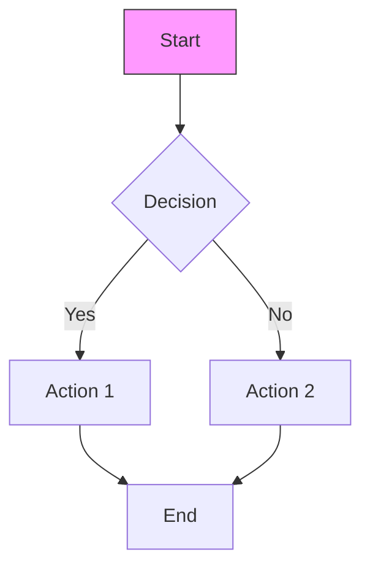

# HIVEMIND Output Standards

## Overview

This document defines the quality standards and formatting requirements for all outputs produced by HIVEMIND agents.

---

## Code Output Standards

### General Requirements

| Requirement | Standard |
|-------------|----------|
| Formatting | Language-specific formatter applied |
| Line length | Maximum 100 characters (soft limit 80) |
| Indentation | Spaces (2 for JS/TS/YAML, 4 for Python) |
| Encoding | UTF-8 |
| Line endings | LF (Unix-style) |
| Trailing whitespace | None |
| Final newline | Required |

### Language-Specific Standards

#### Python
```yaml
formatter: black
linter: ruff, pylint
type_checker: mypy
style_guide: PEP 8
docstrings: Google style
imports: isort (black-compatible)
```

**Example:**
```python
"""Module docstring describing purpose.

Extended description if needed.
"""

from typing import Optional

import third_party_lib

from local_module import helper


def calculate_total(
    items: list[dict],
    discount: Optional[float] = None,
) -> float:
    """Calculate total price with optional discount.

    Args:
        items: List of item dictionaries with 'price' key.
        discount: Optional discount percentage (0.0-1.0).

    Returns:
        Total price after discount.

    Raises:
        ValueError: If discount is outside valid range.
    """
    if discount is not None and not 0 <= discount <= 1:
        raise ValueError("Discount must be between 0 and 1")

    total = sum(item["price"] for item in items)

    if discount:
        total *= 1 - discount

    return total
```

#### JavaScript/TypeScript
```yaml
formatter: prettier
linter: eslint
type_checker: tsc (for TypeScript)
style_guide: Airbnb or StandardJS
```

**Example:**
```typescript
/**
 * Calculate total price with optional discount.
 *
 * @param items - Array of items with price property
 * @param discount - Optional discount percentage (0-1)
 * @returns Total price after discount
 * @throws Error if discount is invalid
 */
export function calculateTotal(
  items: Array<{ price: number }>,
  discount?: number
): number {
  if (discount !== undefined && (discount < 0 || discount > 1)) {
    throw new Error('Discount must be between 0 and 1');
  }

  const total = items.reduce((sum, item) => sum + item.price, 0);

  return discount ? total * (1 - discount) : total;
}
```

#### Go
```yaml
formatter: gofmt, goimports
linter: golangci-lint
style_guide: Effective Go
```

**Example:**
```go
// CalculateTotal computes the total price with an optional discount.
// Returns an error if the discount is outside the valid range [0, 1].
func CalculateTotal(items []Item, discount *float64) (float64, error) {
    if discount != nil && (*discount < 0 || *discount > 1) {
        return 0, fmt.Errorf("discount must be between 0 and 1, got %f", *discount)
    }

    var total float64
    for _, item := range items {
        total += item.Price
    }

    if discount != nil {
        total *= 1 - *discount
    }

    return total, nil
}
```

### Documentation Requirements

| Element | Requirement |
|---------|-------------|
| Public functions/methods | Docstring required |
| Classes/modules | Docstring required |
| Complex logic | Inline comments explaining "why" |
| Magic numbers | Named constants with explanation |
| TODO comments | Include ticket/issue reference |
| Type hints | Required (Python 3.9+, TypeScript) |

### Testing Requirements

| Requirement | Standard |
|-------------|----------|
| Coverage minimum | 80% line coverage |
| Test naming | Descriptive, follows pattern |
| Test isolation | No shared state between tests |
| Assertions | Clear, specific assertions |
| Edge cases | Must be covered |
| Error cases | Must be covered |

**Test naming pattern:**
```
test_[unit]_[scenario]_[expected_outcome]
```

**Example:**
```python
def test_calculate_total_with_discount_returns_reduced_price():
    items = [{"price": 100}, {"price": 50}]
    result = calculate_total(items, discount=0.1)
    assert result == 135.0
```

---

## Document Output Standards

### Markdown Formatting

| Element | Standard |
|---------|----------|
| Headers | ATX style (`#`), single `#` for title only |
| Line length | 80-120 characters (soft wrap) |
| Lists | `-` for unordered, `1.` for ordered |
| Code blocks | Fenced with language identifier |
| Tables | Pipe syntax with alignment |
| Links | Reference style for repeated URLs |
| Images | Alt text required |

### Document Structure

```markdown
# Document Title

## Overview
[Brief description of document purpose]

## Section 1
[Content]

### Subsection 1.1
[Content]

## Section 2
[Content]

---

## References
[Links and citations]

---

*Document metadata (author, date, version)*
```

### Quality Checklist

- [ ] Spelling checked
- [ ] Grammar checked
- [ ] Links validated
- [ ] Code examples tested
- [ ] Tables render correctly
- [ ] No orphan headers
- [ ] Consistent terminology
- [ ] Appropriate detail level

---

## Report Output Standards

### Structure Requirements

All reports must include:

1. **Header/Metadata**
   - Report ID
   - Date
   - Author (agent ID)
   - Classification level

2. **Executive Summary**
   - Key findings (3-5 bullet points)
   - Overall assessment
   - Critical recommendations

3. **Detailed Content**
   - Organized by severity/priority
   - Evidence referenced
   - Clear recommendations

4. **Appendices** (as needed)
   - Raw data
   - Supporting evidence
   - Methodology details

### Formatting Standards

| Element | Standard |
|---------|----------|
| Page length | Executive summary ≤2 pages |
| Finding format | ID, Title, Severity, Description, Evidence, Recommendation |
| Tables | Used for comparative data |
| Charts | Used sparingly, with clear labels |
| References | Numbered or linked |

### Severity Ordering

Reports must order findings by severity:
1. Critical
2. High
3. Medium
4. Low
5. Informational

### Recommendation Format

```markdown
### Recommendation: [Short Title]

**Priority:** [Critical/High/Medium/Low]

**Action:** [Specific, actionable step]

**Owner:** [Suggested owner]

**Timeline:** [Suggested completion timeframe]

**Rationale:** [Why this is recommended]
```

---

## Diagram Output Standards

### Preferred Tools

| Purpose | Primary Tool | Alternative |
|---------|--------------|-------------|
| Architecture | Mermaid | PlantUML |
| Sequence | Mermaid | PlantUML |
| Flowcharts | Mermaid | ASCII |
| ERD | Mermaid | dbdiagram.io |
| Network | draw.io | ASCII |
| Quick sketches | ASCII | Mermaid |

### Mermaid Standards



### Diagram Requirements

| Requirement | Standard |
|-------------|----------|
| Legend | Required for complex diagrams |
| Labels | Clear, concise text |
| Colors | Consistent meaning |
| Direction | Top-to-bottom or left-to-right |
| Complexity | Split if >15 nodes |

### ASCII Diagram Standards

```
┌─────────────┐     ┌─────────────┐
│   Client    │────▶│   Server    │
└─────────────┘     └──────┬──────┘
                           │
                    ┌──────▼──────┐
                    │  Database   │
                    └─────────────┘

Use box-drawing characters:
─ │ ┌ ┐ └ ┘ ├ ┤ ┬ ┴ ┼
▲ ▼ ◀ ▶ (arrows)
```

---

## Data Output Standards

### JSON Standards

```json
{
  "metadata": {
    "version": "1.0",
    "generated_at": "2024-01-15T10:30:00Z",
    "generated_by": "DEV-001"
  },
  "data": {
    "key": "value",
    "nested": {
      "array": [1, 2, 3]
    }
  }
}
```

| Requirement | Standard |
|-------------|----------|
| Indentation | 2 spaces |
| Keys | camelCase or snake_case (consistent) |
| Dates | ISO8601 format |
| Nulls | Explicit `null`, not omitted |
| Arrays | Newline per item if >3 items |

### YAML Standards

```yaml
# Comment describing the file
metadata:
  version: "1.0"
  generated_at: "2024-01-15T10:30:00Z"

data:
  key: value
  nested:
    array:
      - item1
      - item2
```

| Requirement | Standard |
|-------------|----------|
| Indentation | 2 spaces |
| Keys | snake_case preferred |
| Strings | Quoted if special characters |
| Multi-line | Use `|` or `>` |
| Comments | Encouraged for clarity |

### CSV Standards

```csv
id,name,email,created_at
1,"John Doe",john@example.com,2024-01-15T10:30:00Z
2,"Jane Smith",jane@example.com,2024-01-15T11:00:00Z
```

| Requirement | Standard |
|-------------|----------|
| Delimiter | Comma |
| Quoting | Double quotes for strings with commas |
| Headers | Required, first row |
| Encoding | UTF-8 with BOM if needed |
| Newlines | LF |

---

## Communication Standards

### Status Updates

```markdown
## Status Update: [Task ID]

**Date:** [YYYY-MM-DD HH:MM UTC]
**Agent:** [AGENT_ID]

### Progress
- Completed: [What was done]
- In Progress: [Current work]
- Blocked: [Any blockers]

### Next Steps
1. [Next action]
2. [Following action]

### ETA
[Estimated completion time/date]
```

### Handoff Communications

```markdown
## Handoff: [Task ID]

**From:** [SOURCE_AGENT]
**To:** [DEST_AGENT]
**Priority:** [P0-P4]

### Summary
[1-2 sentence summary]

### Context
[Essential background]

### Artifacts
- [Artifact 1]: [Location]
- [Artifact 2]: [Location]

### Required Actions
1. [Action 1]
2. [Action 2]

### Success Criteria
- [ ] [Criterion 1]
- [ ] [Criterion 2]

### Deadline
[Date/time if applicable]
```

---

## Quality Gates

### Pre-Submission Checklist

All outputs must pass before delivery:

- [ ] **Completeness**: No placeholders, TODOs, or incomplete sections
- [ ] **Accuracy**: Information verified, code tested
- [ ] **Formatting**: Follows relevant standards above
- [ ] **Clarity**: Clear, unambiguous language
- [ ] **Consistency**: Terminology and style consistent throughout
- [ ] **References**: All references valid and accessible
- [ ] **Metadata**: Includes author, date, version as appropriate
- [ ] **Classification**: Security classification applied

### Review Criteria

| Criterion | Weight | Description |
|-----------|--------|-------------|
| Correctness | 30% | Technically accurate, no errors |
| Completeness | 25% | All required elements present |
| Clarity | 20% | Easy to understand |
| Formatting | 15% | Follows standards |
| Actionability | 10% | Recommendations are actionable |

---

## Template Usage

### When to Use Templates

| Situation | Template |
|-----------|----------|
| Security assessment findings | `/templates/security-report.md` |
| Architecture decisions | `/templates/architecture-decision-record.md` |
| Security/reliability incidents | `/templates/incident-report.md` |
| Code review feedback | `/templates/code-review-findings.md` |
| Test execution results | `/templates/test-results.md` |
| Production deployments | `/templates/deployment-checklist.md` |
| Infrastructure changes | `/templates/change-request.md` |
| Compliance assessments | `/templates/compliance-checklist.md` |
| Performance testing | `/templates/performance-baseline.md` |

### Template Customization Rules

1. **Do not remove** required sections
2. **May add** additional sections as needed
3. **Replace** all `[PLACEHOLDER]` values
4. **Remove** unused optional sections
5. **Maintain** consistent formatting
